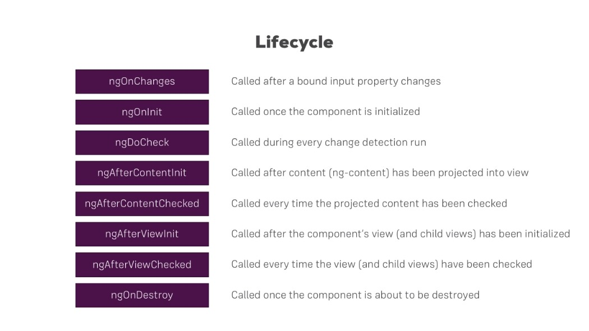

# Angular 2+

## Estrutura e arquitetura
O padrão de criação de componente do Angular é o seguinte:
1. pasta com o nome do compoenente:
    {nomeComponente}.component.html
    {nomeComponente}.component.ts
    {nomeComponente}.component.css

## AppModules
Oarquivo `app.modules.ts`, é o arquivo onde estarão os componentes a serem usados no projeto e os
módulos de terceiros:
````
@NgModule({
  declarations: [ //Modulos declarados para serem usados
    AppComponent,
    ServerComponent
  ],
  imports: [ // bibliotecas e plugins uteis
    BrowserModule,
    AppRoutingModule,
    FormsModule
  ],
  providers: [],
  bootstrap: [AppComponent] // Componente inicial
})
````

## Lifecyles and lifecycle Order

1. **ngOnChanges** - chamado quando com uma uma propriedade linkada de um input muda
2. **ngOnInit** - chamado uma única vez quando o componente é inicializado
3. **ngDoCheck** - chamado quando acontece qualquer mudança ocorre
4. **ngAfterContentInit** - chamado depois do (ng-content) ser renderizado na view
5. **ngAfterContentChecked** - chamado depois do (ng-content) é alterado
6. **ngAfterViewInit** - chamado após o componente e seus filhos serem renderizados.
7. **ngAfterViewChecked** - chamado após componente e seus filhos serem atualizados.
8. **ngOnDestroy** - chamado quando componente está prestes a ser removido do DOM
;
