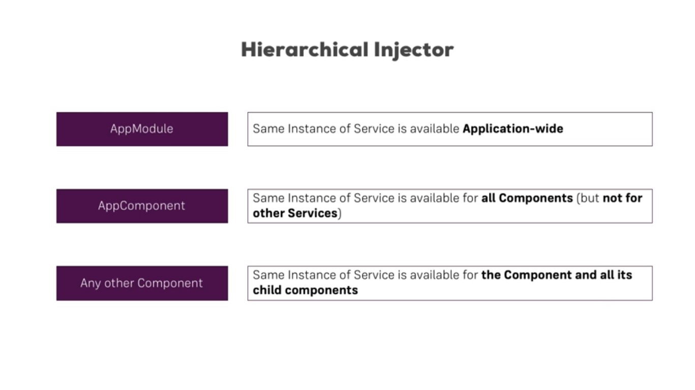

# Services
Servem para trafegar informações entre components, mesmo que estes não se conectem ou usar metodos
em comum para realizar a mesma tarefa.

## Metodo comum entre componentes 
arquivo ´logging.service.ts´
````
export class LoggingService {

  logStatusChange(status: string){
    console.log('A server status changed, new status: ' + status);
  }
}
````
no typeScript do componente:
1. Precisa ser importado.
2. passamos seu tipo para uma variavel private no constructor do componente
3. no decorator do componente precisa estar dentro de um array de providers

````
import { LoggingService } from '../logging.service';

@Component({
  selector: 'app-new-account',
  ...
  providers:[LoggingService]
})
export class NewAccountComponent {
  @Output() accountAdded = new EventEmitter<{name: string, status: string}>();

  constructor(private loggingService: LoggingService){}

  onCreateAccount(accountName: string, accountStatus: string) {
    this.accountAdded.emit({
      name: accountName,
      status: accountStatus
    });
    this.loggingService.logStatusChange(status);
  }
}

````

## Store and manage Data
É possivel instanciar multiplas vezes o serviço, uma para cada componente ou uma para a aplicação inteira, como uma store do `Redux`.

**No caso abaixo Vamos querer apenas uma instancia do servico no AppComponent**

account.services.ts:
````
export class AccountsService {
  accounts = [
    {
      name: 'Master Account',
      status: 'active'
    },
    {
      name: 'Testaccount',
      status: 'inactive'
    },
    {
      name: 'Hidden Account',
      status: 'unknown'
    }
  ];

  addAccount(name:string, status:string){
    let account = {name, status};
    this.accounts.push(account);
  }

  updateStatus(id:number, status:string){
    this.accounts[id].status = status;
  }
}

````

app.component.ts:
````

@Component({
  selector: 'app-root',
  templateUrl: './app.component.html',
  styleUrls: ['./app.component.css'],
  providers:[AccountsService]
})
export class AppComponent implements OnInit{
  accounts : Account[] = [];

  constructor(private accountServices:AccountsService){}

  ngOnInit(){
    this.accounts = this.accountServices.accounts;
    console.log(this.accounts)
  }
}
````
chamando o metodo de criar account (addAccount) do serviço no componente new-account.componet.ts:

````
@Component({
  selector: 'app-new-account',
  templateUrl: './new-account.component.html',
  styleUrls: ['./new-account.component.css'],
  providers:[LoggingService]
})
export class NewAccountComponent {

  constructor(
    private loggingService: LoggingService,
    private accountService: AccountsService,
  ){}

  onCreateAccount(accountName: string, accountStatus: string) {
    this.accountService.addAccount(accountName, accountStatus);
    this.loggingService.logStatusChange(status);
  }
}
````
**Nota que não foi passado no provider o AccountService, pois já é passado pelo App.component.ts se tivesse sido chamado no provider do new-account.component.ts, teria uma nova instancia**


### Hierarquia de Injeção
;


## Injecting services into another service (@Injectable())
**aqui estamos usando os Serviços no provider de app.module.ts**
````
@NgModule({
  declarations: [
    AppComponent,
    AccountComponent,
    NewAccountComponent
  ],
  imports: [
    BrowserModule,
    FormsModule
  ],
  providers: [AccountsService, LoggingService],
  bootstrap: [AppComponent]
})
export class AppModule { }

````

Para passar a instancia de um serviço para outro é necessário adicionar o decorator
@Injectable()

````
@Injectable()
export class AccountsService {
  accounts = [
    ...
  ];

  constructor(private loggingService: LoggingService){}

  addAccount(name:string, status:string){
    ...
    this.loggingService.logStatusChange(status);
  }

  updateStatus(id:number, status:string){
    ...
    this.loggingService.logStatusChange(status);
  }
}
````

### Angular 6+ sintaxe alternativa para disponibilizar o serviço para toda aplicação:
Em qualquer serviço:

````
@Injectable({
  providedIn:'root'
})
````

## Corss Component comunication
no servico `account.service.ts`, criamos um emissor de envento:
````
@Injectable()
export class AccountsService {
  accounts = [
    ...
  ];

  statusUpdated:EventEmitter<string> = new EventEmitter<string>();

  ...
}
````

então no `account.component.ts`, emitimos um evento toda vez que o status mudar, usando o emissor criado no `account.service.ts`:

````
@Component({
  selector: 'app-account',
  templateUrl: './account.component.html',
  styleUrls: ['./account.component.css'],
})
export class AccountComponent {
  @Input() account: {name: string, status: string};
  @Input() id: number;

  constructor(
    private accountService: AccountsService
  ){}

  onSetTo(status: string) {
    this.accountService.updateStatus(this.id, status);
    this.accountService.statusUpdated.emit(status);
  }
}
````

então no `new-account.component.ts`, recebemos o evento emitido pelo `account.service.ts`:

````
@Component({
  selector: 'app-new-account',
  templateUrl: './new-account.component.html',
  styleUrls: ['./new-account.component.css'],
})
export class NewAccountComponent {

  constructor(
    private accountService: AccountsService,
  ){
    this.accountService.statusUpdated.subscribe(
    (status:string)=> console.log(`escutando o evento de mudança de status, status : ${status}`)
    )
  }
  ...
}

````
